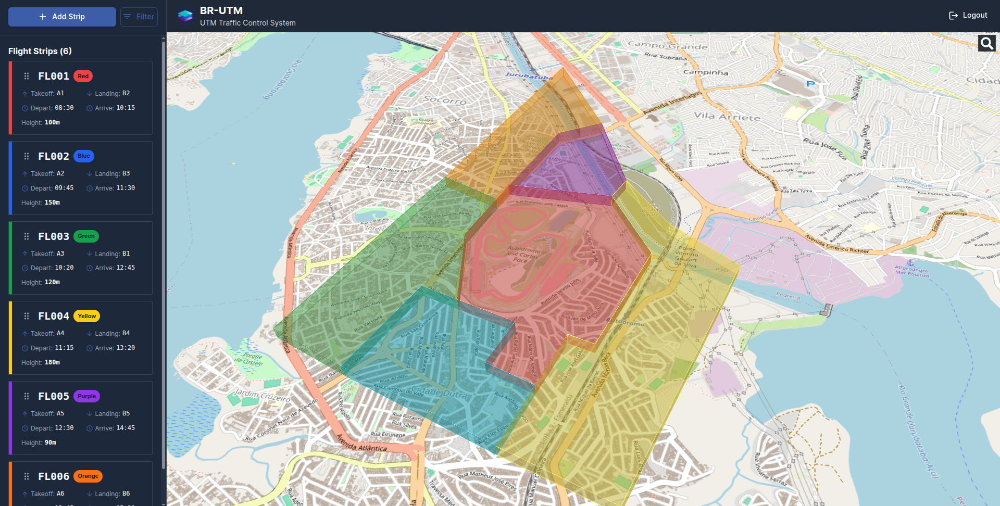

# UTM Manager - Airspace Control Module

A specialized airspace management interface developed as part of the BR-UTM (Brazilian Unmanned Traffic Management) project. This module specifically was developed to handle registered drone operations during the Formula 1 Event in Brazil 2025, managing airspace control across 6 designated zones around the F1 track with real-time flight strip management and 3D visualization capabilities. As we integrated the tool into the Brazil UTM ecosystem, we have the possity of displaying live position of drone in the selected areas, which help the traffic controllers to better coordinate positions.

## Application Demo

### Screenshots



### Video Demo

[output.webm](https://github.com/user-attachments/assets/a1832c0b-138c-4920-9d9a-d227e9792e8d)

## Overview

This module is part of the larger BR-UTM (Brazilian Unmanned Traffic Management) project, which encompasses multiple systems and components for comprehensive drone airspace management across Brazil. This specific component focuses on the Formula 1 Event in Brazil 2025, where the Brazilian Airspace Department has divided the zones near the F1 track into 6 distinct operational areas: Red, Orange, Green, Purple, Blue, and Yellow zones.

When authorities such as police officers, firefighters, or other authorized personnel need to operate drones in the region, an Airspace Traffic Controller records flight information on strips, documenting which zone is occupied, by whom, at what altitude, departure/arrival times, and aircraft identification.

### Features

- **6-Zone Airspace Management**: Red, Orange, Green, Purple, Blue, and Yellow zones with interactive 3D world visualization
- **Flight Strip Management**: Complete lifecycle management of flight strips with filtering and creation capabilities
- **Real-time Drone Tracking**: Receives and displays positions from drones that either voluntarily share information or is tracked by an integrated radar
- **Interactive 3D Map**: Cesium-powered 3D viewer with clickable zones and drone markers
- **Multi-Zone Filtering**: Select multiple zones to filter aircraft operations across different areas

## Architecture

- **Backend**: FastAPI-based REST API with hexagonal architecture principles
- **Frontend**: React + TypeScript with Vite, featuring Cesium for 3D visualization
- **Deployment**: Single image docker containerized with nginx to run both frontend and back-for-front backend application
- **Database**: Backend leverages MongoDB database

## F1 Event Airspace Zone Configuration

This module manages 6 designated airspace zones specifically configured for the Formula 1 Brazil 2025 event:

### Flight Strip Management Workflow

1. **Authority Request**: Police, firefighters, or authorized personnel request drone operation
2. **Strip Creation**: Airspace Traffic Controller creates flight strip with zone assignment
3. **Zone Documentation**: Records aircraft ID, altitude, departure/arrival times, and operator details
4. **Real-time Monitoring**: Track drone positions and zone occupancy status
5. **Multi-zone Operations**: Coordinate flights across multiple zones when required

### Interactive Features

- **Zone Selection**: Click on 3D zones to filter aircraft in specific areas
- **Drone Tracking**: Click on drone markers to view detailed flight information
- **Multi-zone Filtering**: Select multiple zones simultaneously for comprehensive monitoring
- **Flight Strip Sidebar**: Complete list of active flights with filtering capabilities

## Quick Start

### Prerequisites

- Docker and Docker Compose
- Node.js 18+ (for local development)
- Python 3.11+ (for local development)

### Environment Setup

1. Copy environment files:

```bash
cp backend/.env.sample backend/.env.dev
cp interface/.env.sample interface/.env
```

2. Configure your environment variables in the copied files.

### Development

**Backend:**

```bash
cd backend
pip install -r requirements.txt
python main.py
```

**Frontend:**

```bash
cd interface
npm install
npm run dev
```

## License

This project is licensed under the terms specified in the LICENSE file.

## Support

For questions and support, please create an issue in the repository.
