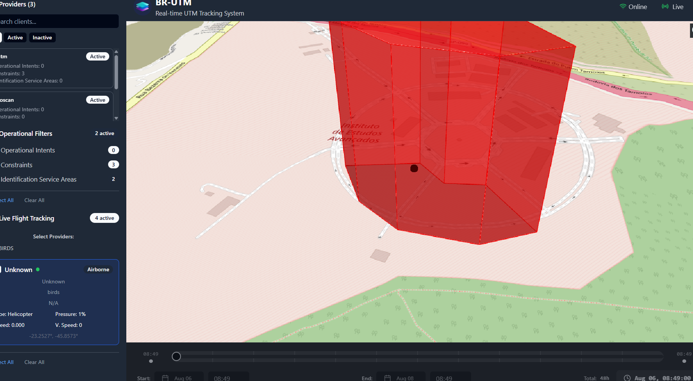

# BR-UTM Interface

A comprehensive UTM (Unmanned Traffic Management) observation system built with FastAPI backend and React frontend, featuring real-time airspace monitoring and constraint management capabilities.

## Live Demo

https://github.com/user-attachments/assets/ef64030b-09e9-4289-8840-a1bcb1872276

## Screenshot



## Overview

BR-UTM Interface provides a web-based interface for monitoring and managing unmanned aircraft systems (UAS) operations within Brazilian airspace. The system offers real-time visualization using Cesium 3D globe technology and robust backend APIs for airspace and constraint management.

## Architecture

- **Backend**: FastAPI-based REST API with clean architecture principles
- **Frontend**: React + TypeScript with Vite, featuring Cesium for 3D visualization
- **Deployment**: Docker containerized with nginx reverse proxy
- **Database**: MongoDB integration via Motor async driver

## Quick Start

### Prerequisites

- Docker and Docker Compose
- Node.js 18+ (for local development)
- Python 3.11+ (for local development)

### Environment Setup

1. Copy environment files:
```bash
cp backend/.env.sample backend/.env.dev
cp interface/.env.sample interface/.env
```

2. Configure your environment variables in the copied files.

### Development

#### Using Docker Compose
```bash
# Start all services
docker-compose -f docker-compose.dev.yml up

# Backend will be available at http://localhost:8000
# Frontend will be available at http://localhost:80
```

#### Local Development

**Backend:**
```bash
cd backend
pip install -r requirements.txt
python main.py
```

**Frontend:**
```bash
cd interface
npm install
npm run dev
```

### Production Deployment

```bash
docker-compose up -d
```

## API Documentation

Once running, access the interactive API documentation at:
- Swagger UI: `http://localhost:8000/docs`
- ReDoc: `http://localhost:8000/redoc`

### Main Endpoints

- `/api/airspace` - Airspace management operations
- `/api/constraints` - Constraint and restriction handling
- `/api/healthy` - System health checks

## Project Structure

```
├── backend/                 # FastAPI backend
│   ├── adapters/           # External service adapters
│   ├── application/        # Application services
│   ├── domain/            # Domain models and logic
│   ├── infrastructure/    # Infrastructure components
│   ├── ports/             # Interface definitions
│   ├── routes/            # API route handlers
│   ├── schemas/           # Pydantic models
│   └── services/          # Business logic services
├── interface/             # React frontend
│   ├── src/              # Source code
│   ├── public/           # Static assets
│   └── dist/             # Build output
├── docs/                 # Documentation
└── docker-compose.yml    # Production deployment
```

## Technology Stack

### Backend
- **FastAPI** - Modern Python web framework
- **Motor** - Async MongoDB driver
- **Pydantic** - Data validation and serialization
- **JWT** - Authentication and authorization
- **Uvicorn** - ASGI server

### Frontend
- **React 19** - UI framework
- **TypeScript** - Type safety
- **Vite** - Build tool and dev server
- **Cesium** - 3D globe and mapping
- **Tailwind CSS** - Styling framework
- **Radix UI** - Component primitives
- **React Query** - Data fetching and caching

## Development Guidelines

### Code Style
- Backend follows Black formatting (line length: 79)
- Frontend uses ESLint with TypeScript rules
- Both codebases maintain strict type checking

### Testing
```bash
# Backend tests
cd backend
pytest

# Frontend tests
cd interface
npm run test
```

## Contributing

1. Fork the repository
2. Create a feature branch
3. Make your changes following the code style guidelines
4. Add tests for new functionality
5. Submit a pull request

## License

This project is licensed under the terms specified in the LICENSE file.

## Support

For questions and support, please refer to the project documentation or create an issue in the repository.
